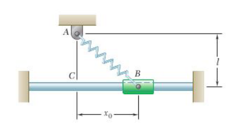
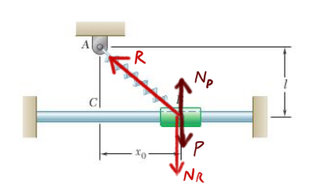
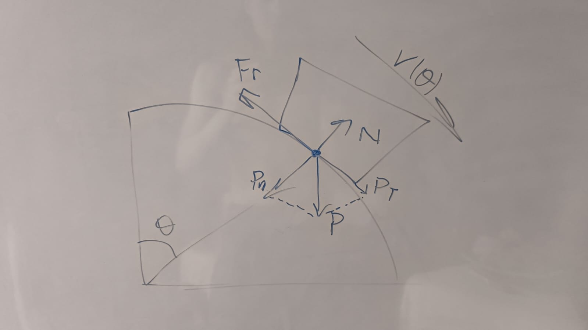

# Ejercicio 1



Un resorte **AB** de constante **k** se une a un soporte **A** y a un collarín de masa **m**.  
La longitud no alargada del resorte es **L**.  
Si se suelta el collarín desde el reposo en $x=x_0$ y se desprecia la fricción entre
el collarín y la varilla horizontal, determine la magnitud de la velocidad del collarín 
cuando pasa por el punto **C**.

### Diagrama de Cuerpo Libre



Ya que se desprecia la fricción entre el collarín y la varilla horizontal, 
no hay fuerzas no conservativas actuando sobre el cuerpo, por lo que 
$W_{fnc} = \Delta E = 0J$

Luego, la energía en un punto es igual a:

$$E = E_{cinetica}+E_{potencial} = {1 \over 2}m.v^2 + m.g.y + {1 \over 2} k. (\Delta x)^2$$

Para este problema, vamos a descartar a la energía potencial gravitatoria, ya que 
la varilla mantiene al collarín a una misma altura. Eligiendo como nuestro eje al punto C, 
en todas las ecuaciones va a valer 0.

Si observamos el punto B:

$$E_B = 0 + 0 + {1 \over 2} k.(L_b - L)^2$$
(Como se soltó al collarín desde el reposo, la energía cinética es nula)

Siendo $L_b$ la longitud desde el punto A hasta el punto B. Por lo que:

$$E_B = {1 \over 2} k.((\sqrt{ x_0^2 + L^2 })-L)^2$$

Si ahora observamos la energía en el punto C:

$$E_C = {1 \over 2} m.v^2 + 0 + {1 \over 2} k.(L_C - L)^2$$

Y como $L_C$ es la distancia desde el punto A al punto C, $L_C = L$. Por lo tanto:

$$E_C = {1 \over 2} m.v^2$$

Ahora, sabiendo que $W_{fnc} = \Delta E = 0J$:

$$W_{fnc} = \Delta E = 0J = E_C - E_B = {1 \over 2} m.v^2 - {1 \over 2} k.((\sqrt{ x_0^2 + L^2 })-L)^2$$

De donde sale que:
$$v = \sqrt {k.((\sqrt{ x_0^2 + L^2 })-L)^2 \over m}$$

# Ejercicio 2

## Apartado a)

Tenemos que un satélite se ubica en una órbita circular, por lo cual la fuerza de gravedad F que la tierra ejerce sobre el satélite es normal a la órbita, y se tiene que $F = {GMm \over r^2}$, donde G es la constante de gravitación universal, M es la masa de la tierra, m es la masa del satélite y r es la distancia del satélite al centro de la tierra.

También podemos escribir $F = ma$, y como $a = {v^2 \over r}$ obtenemos $F = {GMm \over r^2} = m {v^2 \over r}$, de donde $v^2 = {GM \over r}$.

Además sabemos que $GM = gR^2$, donde R es el radio de la tierra y g la aceleración de la gravedad, por lo cual escribimos $v^2 = {gR^2 \over r}$. Finalmente, despejamos la velocidad $v = R \sqrt{g \over r} = \sqrt{GM \over r}$ con la cual el satélite describe su órbita.

Además, la velocidad con la cual el satélite describe su órbita es $v = {2 \pi r\over T}$, donde T es el período (que tenemos como dato, T = 23.934 h). Luego, $R \sqrt{g \over r} = {2 \pi r\over T} \Rightarrow T = {2 \pi r \over {R \sqrt{g \over r}}}$

Para los siguientes cálculos utilizaremos estos valores de las constantes g y R:

* $g = 9.81~m/s^2 = 127137.6~km/h^2$
* $R = 6.37~.~10^6~m = 6370~km$

Ahora planteamos:

$$T = 23.934~h = {2 \pi \over R} {r \over \sqrt{g \over r}}$$
$$\Rightarrow$$
$${r \over \sqrt{g \over r}} = 24264.7~km~h$$
$$\Rightarrow$$
$${r^2 \over {g \over r}} = 588775461.2~km^2~h^2$$
$$\Rightarrow$$
$${r^3 \over g} = 588775461.2~km^2~h^2$$
$$\Rightarrow$$
$$r^3 = 588775461.2~km^2~h^2 * 127137.6~km/h^2 = 7.49~.~10^{13}~km^3$$
$$\Rightarrow$$
$$r = \sqrt[3]{7.49~.~10^{13}~km^3}$$
$$\Rightarrow$$
$$r = 42144.53~km$$

Obtuvimos que la distancia del satélite al centro de la tierra es $r = 42144.53~km$. Nosotros queremos calcular la distancia $d$ del satélite a la superficie terrestre, que será $d = r - R = (42144.53 - 6370)~km$.

Por lo tanto, al distancia del satélite a la superficie de la tierra es

$$\bold{d = 35774.53~km = 22229.26~mi}$$

En unidades del USI y de uso común en Estados Unidos resulta

$$\bold{d = 35774530~m = 117370492.8~ft}$$

## Apartado b)

En el apartado anterior dijimos que $v = {2 \pi r\over T}$. Luego:

$$v = 2 \pi {42144.53~km\over 23.934~h}$$
$$\Rightarrow$$
$$v = 2 \pi~1760.86~km/h$$

Finalmente, resulta

$$\bold{v = 11063.84~km/h = 6874.75~mi/h}$$

En unidades del USI y de uso común en Estados Unidos resulta

$$\bold{v = 3073.29~m/s = 10082.97~ft/s}$$


# Ejercicio 3

Queremos encontrar los valores de $\theta$ para los cuales el bloque pierde el contacto
con la superficie, con un coeficiente de fricción cinética desde 0 hasta 0,4.

Eso significa que queremos encontrar los valores de $\theta$ para los cuales $N = 0$ (la normal)

### Diagrama de cuerpo libre



Cosas que sabemos:

Teniendo en cuenta que el bloque se encuentra en un movimiento circular podemos afirmar que: 

$$N = m.a = m.(g.\cos{\theta} - {(v_{\theta})^2 \over r})$$

$$N = 0 = m.(g.\cos{\theta} - {(v_{\theta})^2 \over r}) = g.\cos{\theta} - {v_{\theta}^2 \over r}$$

$${v_{\theta}^2 \over r} = g.\cos{\theta} \implies {v_{\theta}^2 \over \cos{\theta}} = r.g$$

Por lo que necesitamos encontrar $v_{\theta}^2$

#### Acercamiento a través de la energía

$$W_{fnc} = \Delta E$$

$$E = {1 \over 2} m.v^2 + m.g.y$$

$$F_r = \mu_c * N = \mu_c * P * \cos{\theta}$$

$$W_{fnc} = W_{roce} = \int_0^{\theta}{F_r * d\theta} = \mu_c * P * \int_0^{\theta}{\cos{\theta} * d\theta} = \mu_c * P * \sin{\theta}$$

$$W_{fnc} = E_{\theta} - E_0$$

$$\mu_c * P * \sin{\theta} = {1 \over 2} m.v_{\theta}^2 + m.g.y_{\theta} - {1 \over 2} m.v_0^2 - m.g.y_0$$

$${1 \over 2} m.v_{\theta}^2 = {1 \over 2} m.v_0^2 + m.g.(y_0 - y_{\theta}) + \mu_c * P * \sin{\theta}$$

$$m.v_{\theta}^2 = m.v_0^2 + 2.m.g.(y_0-y_{\theta}) + 2*\mu_c * P * \sin{\theta}$$

Ademas $y_{\theta} = r.\cos{\theta}$

$$v_{\theta}^2 = v_0^2 + 2.g.(y_0-y_{\theta}) + 2*\mu_c * g * \sin{\theta}$$

Por lo tanto:

$${v_0^2 + 2.g.(y_0-y_{\theta}) + 2*\mu_c * g * \sin{\theta} \over \cos{\theta}} - r.g = 0$$

Luego, resolvemos esta ecuacion buscando el valor de $\theta$, en un programa en python, para cada valor de $\mu_c$ entre 0 y 0.4

```python
import numpy as np
import matplotlib.pyplot as plt

# Constantes
g = 9.8  # Gravedad
r = 1.524  # Radio
v0 = 3.5**2  # Velocidad inicial
m = 0.45 # Masa
energia_inicial = (1/2) * v0 * m + m * g * r

# Magnitud del roce
def Fr(mu, theta):
    return mu * g * m * np.cos(theta)

# Altura cuando el bloque esta en el angulo theta
def altura(theta):
    return r * np.cos(theta)

def potencial(theta):
    return  m * g * altura(theta)

def W_fnc(mu,theta):
    return Fr(mu, theta) * theta * r

def velocidad_cuadrado(mu, theta):
    return v0 + 2*g*(r - altura(theta)) + 2*mu*g* np.sin(theta)


radianes = np.linspace(0, np.pi / 2, 100)  # Valores de radianes de 0 a pi/2
coeficientes = np.linspace(0, 0.4, 100)  # Valores de mu en el rango [0, 0.4]

# Listas para almacenar los puntos que cumplen la igualdad
x_points = []
y_points = []

# Comprobación de la igualdad
for mu in coeficientes:
    for theta in radianes:
        division = (m*g) - (velocidad_cuadrado(mu, theta) / np.cos(theta)) 
        if np.isclose(division,0, atol=1):  # Tolerancia para la comparación
            x_points.append(mu)
            y_points.append(theta)

# Graficar los puntos que cumplen la igualdad
plt.figure(figsize=(10, 6))
plt.plot(x_points, y_points, color='b', label=r'$\theta(\mu_c)$')
plt.xlabel('Coeficiente de rozamiento')
plt.ylabel('Theta crítico')
plt.title('Donde se desprende el bloque')
plt.xlim(0, 0.4)
plt.ylim(0, np.pi / 2)
plt.grid()
plt.savefig("grafica.png")
```

Lamentablemente las conclusiones parecieran haber sido erroneas, puesto que la gráfica no
presenta valores para los cuales el bloque se separe de la superficie.


