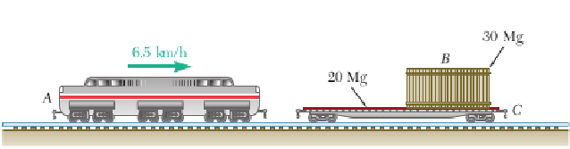

## Ejercicio 2

Una locomotora A de 80 Mg que viaja a 6.5 km/h choca con un carro plataforma C
de 20 Mg que transporta una carga B de 30 Mg, la cual puede deslizarse a lo largo
del piso (μ=0.25).  
Si se sabe que el carro plataforma estaba en reposo, sin frenos, 
y que se acopló automáticamente con la locomotora luego del impacto,
determine la velocidad del carro plataforma

a) Inmediatamente después del impacto
b) Después de que la carga se ha deslizado con relación al carro plataforma hasta llegar a un
tope.

### apartado a)

Consideramos al sistema que integran A, B, y C como un sistema aislado, 
puesto que no hay fuerzas externas significativas que afecten a las locomotoras.  
Si bien el peso de A, B, y C no es nulo, este se ve equilibrado por la normal del suelo.
Por lo que se anulan y no afectan al movimiento horizontal.

Por lo tanto solo necesitamos considerar el efecto que tienen las partículas entre ellas.

$\dot L = \sum F_{externas}$, y como el sistema es aislado $\sum F_{externas} = 0$ por lo tanto
$\dot L = 0$ y $L$ es constante (conservación de la cantidad de movimiento lineal).

Debido a la conservación de la cantidad de movimiento lineal, inicialmente $L = m_A*v_A$.  
Luego, aumenta la masa del sistema (se acopla C) y por lo tanto la velocidad disminuye.  

$$L = m_A*v_A = (m_A + m_C) * v_{choque}$$
(No incluimos la masa de B porque en el instante del choque el movimiento de A no lo afecta.)

A partir de esta ecuación despejamos la velocidad del carro plataforma C

$$v_{choque} = {m_A*v_A \over (m_A + m_C)} = {80Mg*6.5{km \over h} \over 80Mg + 20Mg}
             = {26{km \over h} \over 5} = 5,2{km \over h}$$

### apartado b)

Ahora nos encontramos en el momento en que la carga se deslizó con relación al carro plataforma hasta llegar a un tope. Esto quiere decir que la partícula B está en movimiento y la fricción entre B y C actúa hasta que B y C se mueven a la misma velocidad (cuando llega al tope) junto al resto del sistema.

Por lo tanto, el sistema incorpora la masa de B, y debido a la conservación del movimiento lineal:

$$L = m_A*v_A = (m_A + m_B + m_C) * v_{final}$$

Despejando la velocidad final del carro plataforma

$$v_{final} = {m_A*v_A \over (m_A + m_B + m_C)} = {80Mg*6.5{km \over h} \over 80Mg + 30Mg + 20Mg}
             = 4{km \over h}$$

