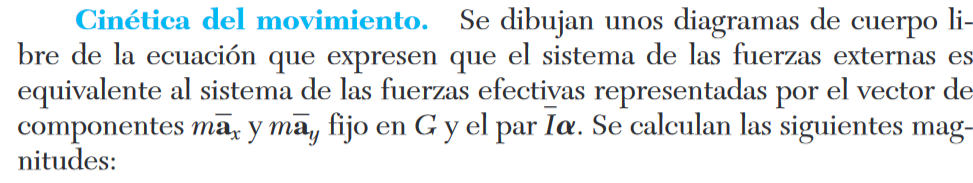

# Ejercicio 3

### Parte 1

Nuestro objetivo consiste en obtener la fuerza normal sobre los puntos A y B en función del angulo theta.

Sabemos que la barra se está moviendo hacia abajo aceleradamente, por lo tanto sabemos (por segunda ley de Newton)
que la suma de las fuerzas en Y son:

$$m * \overline{a} = N_A + - P$$

por lo tanto tenemos que:

$$N_A = m * g - m * \overline{a} = m * (g - \overline{a})$$

ahora, sabemos que $\overline{a}$ es $\frac{1}{2} (a_A + a_B)$ pero como la velocidad de A es constante tenemos que

$$\overline{a} = \frac{1}{2} a_B$$

para saber la aceleración de B en función de theta vamos a plantear lo siguiente:

la aceleración de B se puede expresar como $a_B = a_A + a_{B/A}$

como a se mueve a velocidad constante, nos queda:

$$a_B = a_{B/A} = (a_{B/A})_t + (a_{B/A})_n$$

para poder calcular estas componentes vamos a utilizar el centro de rotación instantanea

la velocidad angular del CRI se puede calcular y es:

$$\omega = \frac{v_A} {L\cos(\theta)}$$

sabiendo esto tenemos (por teorema del seno) que:

$$\frac{L\omega^2}{cos(\theta)} = a_B$$

También podemos obtener la aceleración tangencial :

$$ \frac{L * \alpha}{\sin(\theta)}= a_B = \frac{L\omega^2}{cos(\theta)}$$

$$\alpha = \omega^2 * \tan(\theta)$$

Con esto último y el momento de inercia de la vara:

$$I = \frac{1}{12} * m * L^2$$

Fuente para momento de inercia de la vara (problema resuelto 16.10 del libro):

Y entonces podemos plantear lo siguiente:

De lo cual podemos concluir:

$$N_B * L * \cos(\theta)  - P * (L/2) * \sin(\theta) = - m * \overline{a} * (L/2) * \sin(\theta) - \overline{a} * \alpha$$

y por lo tanto:

$$N_B = \frac{\frac{1}{2} * m * L (g - \overline{a}) * \sin(\theta) - \frac{1}{12} m * L^2 \alpha }{L * \cos(\theta)}$$

### Parte 2

Para poder determinar en que momento se separa la vara de la pared, solo debemos encontrar cuando la normal de B se vuelve 0.
Para eso vamos a utilizar el código realizado y indicaremos cuando $N_B$ es 0.

Los resultados entonces son los siguientes:

# ...¿Que pasó?

Luego de discutirlo con un par de compañeros, llegamos a la conclusión de que el ejercicio tiene un pequeño error, culpa de la traducción al español. En la versión en inglés del ejercicio, la velocidad de A es $1.5 \frac{m}{s}$. Por lo que en esta versión del ejercicio, la velocidad es tan alta que se despega inmediatamente de la pared.

Si tenemos en cuenta el error y ponemos la velocidad del ejercicio en inglés, tenemos:

