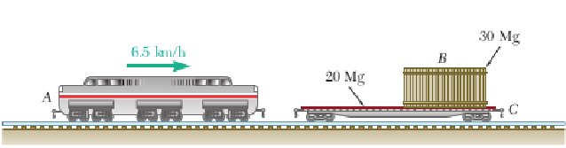
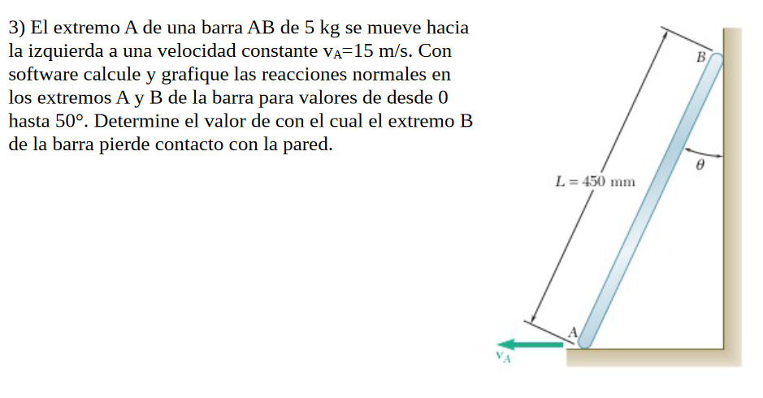
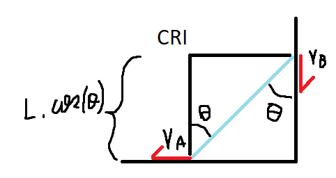
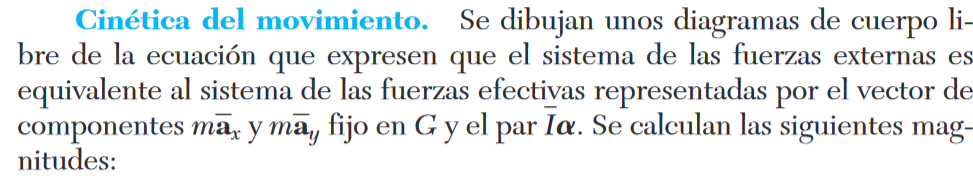
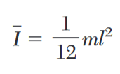
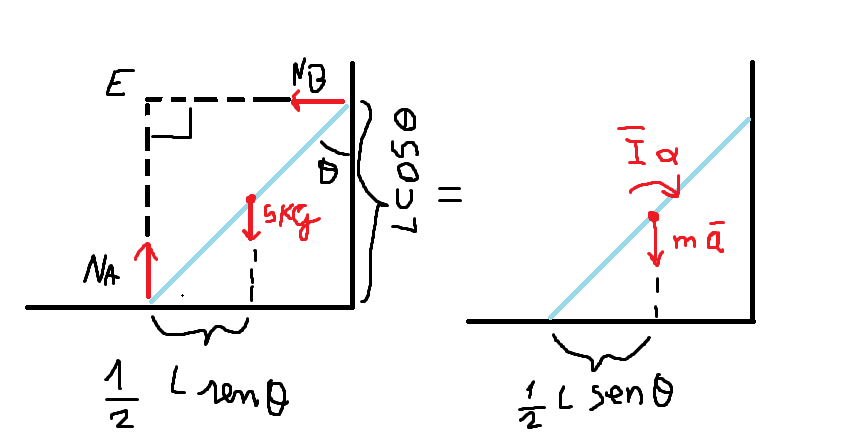
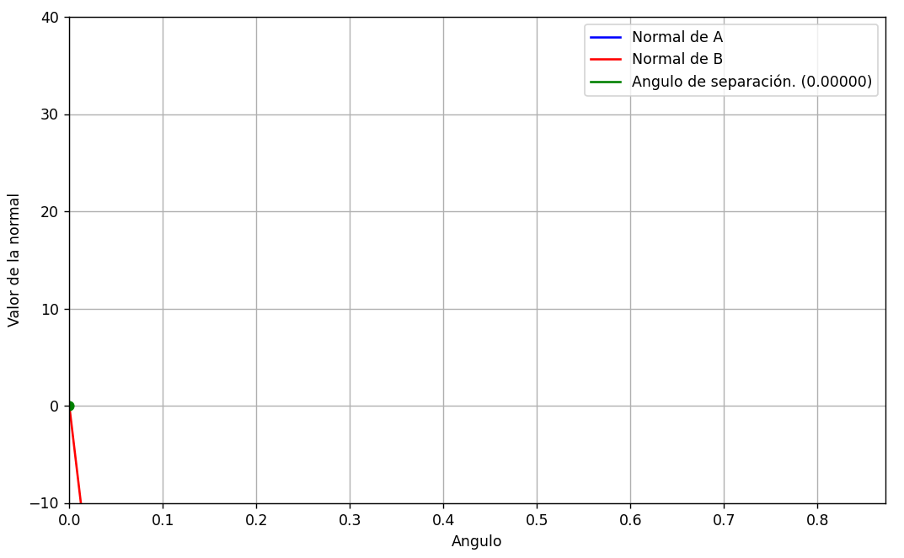
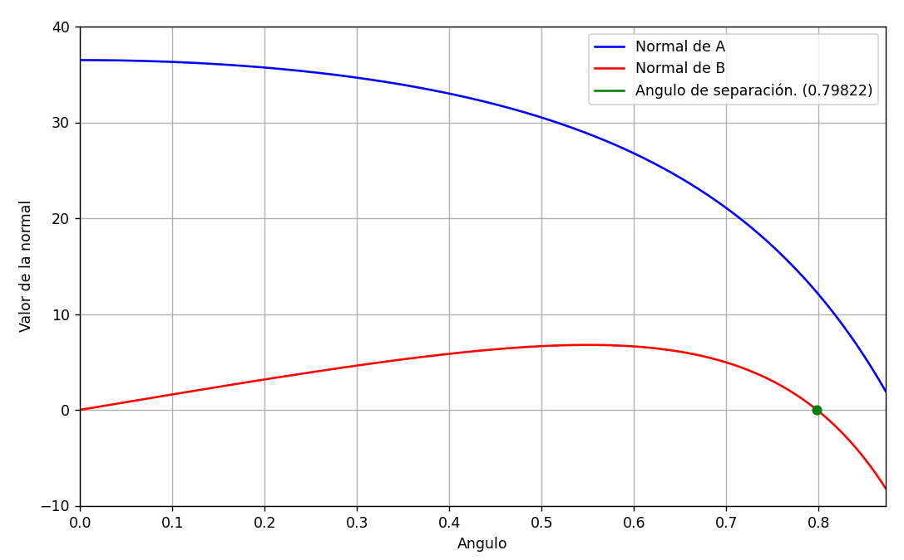

# Ejercicio 1

## Apartado a)

El vagón de longitud $L$ y rapidez inicial $v_0$ junto a la arena que cae sobre él conforman un sistema de partículas. Tenemos que la sumatoria de las fuerzas externas que actúan sobre el sistema es igual a 0: $\sum F = 0$. 

Siendo $P_0 = m_0 v_0$ la cantidad de movimiento inicial (antes de pasar por el conducto) y $P = mv$ la cantidad de movimiento final (tras pasar por el conducto), por conservación de la cantidad de movimiento debe ser $P_0 = P \Rightarrow$ $m_0v_0 = mv$, donde $m$ y $v$ son la masa y la velocidad del sistema tras pasar por el conducto, respectivamente. Podemos descomponer $m = m_0 + m_1$, donde $m_1$ es la masa que gana el sistema (la masa de arena que cae sobre el vagón).

Consideremos que el tiempo inicial es $t_0 = 0~s$ y el tiempo final es $t_f$. Además, la masa inicial de arena sobre el vagón (antes de que caiga algún grano) es $0~kg$.

Tenemos que ${{dm} \over dt} = q$. Luego:
$${{dm} \over dt} = q$$
$$\Rightarrow$$
$$dm = q~dt$$
$$\Rightarrow$$
$$\int_{0}^{m_1} dm = \int_{t_0}^{t_f} q~dt$$
$$\Rightarrow$$
$$m_1 = q~t_f$$

Por lo tanto, reemplazando en la ecuación anterior, tenemos que $m_0v_0 = (m_0 + qt_f)v$. Para cualquier instante $t$ la ecuación resulta $m_0v_0 = (m_0 + qt)v$

Ya conocemos el desplazamiento del sistema en el intervalo $[t_0, t_f]$: es igual a L (ya que el vagón abandonará el conducto una vez que toda su longitud lo abandone). Consideramos entonces que la posición del sistema en el instante $t_0$ es $x_0 = 0~m$ y en el instante $t_f$ es $x_f = L$.

De la última ecuación despejamos $v = {{m_0v_0} \over m_0 + qt}$, y como $v = {dx \over dt}$, tenemos que ${dx \over dt} = {{m_0v_0} \over m_0 + qt_f} \Rightarrow dx = {{m_0v_0~dt} \over m_0 + qt}$. Luego:

$$dx = {{m_0v_0~dt} \over m_0 + qt}$$
$$\Rightarrow$$
$$\int_{0}^{L} dx = \int_{0}^{t_f} {{m_0v_0~dt} \over m_0 + qt}$$
$$\Rightarrow$$
$$\int_{0}^{L} dx = m_0v_0 \int_{0}^{t_f} {dt \over m_0 + qt}$$
$$\Rightarrow$$
$$Sustitución: u = m_0 + qt; du = qdt \Rightarrow {du \over q} = dt$$
$$\Rightarrow$$
$$L = m_0v_0 \int_{0}^{t_f} {du \over qu}$$
$$\Rightarrow$$
$$L = {m_0v_0 \over q} \int_{0}^{t_f} {du \over u}$$
$$\Rightarrow$$
$$L = {m_0v_0 \over q} \left[ln(u)\right]_{0}^{t_f}$$
$$\Rightarrow$$
$$L = {m_0v_0 \over q} \left[ln(m_0 + qt)\right]_{0}^{t_f}$$
$$\Rightarrow$$
$$L = {m_0v_0 \over q}~(ln(m_0 + qt_f) - ln(m_0 + q * 0~s))$$
$$\Rightarrow$$
$$L = {m_0v_0 \over q}~(ln(m_0 + qt_f) - ln(m_0))$$
$$\Rightarrow$$
$$L = {m_0v_0 \over q}~ln({{m_0 + qt_f} \over m_0})$$

Nosotros queremos obtener $m = m_0 + qt_f$. Despejando en la última ecuación tenemos:

$$L = {m_0v_0 \over q}~ln({{m_0 + qt_f} \over m_0})$$
$$\Rightarrow$$
$${qL \over m_0v_0} = ln({{m_0 + qt_f} \over m_0})$$
$$\Rightarrow$$
$$e^{qL \over m_0v_0} = e^{ln({{m_0 + qt_f} \over m_0})}$$
$$\Rightarrow$$
$$e^{qL \over m_0v_0} = {{m_0 + qt_f} \over m_0}$$
$$\Rightarrow$$
$$m_0~e^{qL \over m_0v_0} = m_0 + qt_f = m$$

Finalmente, la masa del vagón y su carga tras dejar atrás el conducto es:

$$\bold{m = m_0~e^{qL \over m_0v_0}}$$

## Apartado b)

En el apartado anterior despejamos $v = {{m_0v_0} \over m_0 + qt}$. Por lo tanto para el instante $t_f$ tenemos:

$$v = {{m_0v_0} \over m_0 + qt_f}$$
$$\Rightarrow$$
$$v = {{m_0v_0} \over m}$$
$$\Rightarrow$$
$$v = {{m_0v_0} \over {m_0~e^{qL \over m_0v_0}}}$$
$$\Rightarrow$$
$$v = {{v_0} \over {e^{qL \over m_0v_0}}}$$
$$\Rightarrow$$
$$v = {v_0~e^{-{qL \over m_0v_0}}}$$

Por lo tanto, la rapidez del vagón al dejar atrás el conducto es:

$$\bold{v = {v_0~e^{-{qL \over m_0v_0}}}}$$

## Ejercicio 2

Una locomotora A de 80 Mg que viaja a 6.5 km/h choca con un carro plataforma C
de 20 Mg que transporta una carga B de 30 Mg, la cual puede deslizarse a lo largo
del piso (μ=0.25).  
Si se sabe que el carro plataforma estaba en reposo, sin frenos, 
y que se acopló automáticamente con la locomotora luego del impacto,
determine la velocidad del carro plataforma

a) Inmediatamente después del impacto
b) Después de que la carga se ha deslizado con relación al carro plataforma hasta llegar a un
tope.

### apartado a)

Consideramos al sistema que integran A, B, y C como un sistema aislado, 
puesto que no hay fuerzas externas significativas que afecten a las locomotoras.  
Si bien el peso de A, B, y C no es nulo, este se ve equilibrado por la normal del suelo.
Por lo que se anulan y no afectan al movimiento horizontal.

Por lo tanto solo necesitamos considerar el efecto que tienen las partículas entre ellas.

$\dot L = \sum F_{externas}$, y como el sistema es aislado $\sum F_{externas} = 0$ por lo tanto
$\dot L = 0$ y $L$ es constante (conservación de la cantidad de movimiento lineal).

Debido a la conservación de la cantidad de movimiento lineal, inicialmente $L = m_A*v_A$.  
Luego, aumenta la masa del sistema (se acopla C) y por lo tanto la velocidad disminuye.  

$$L = m_A*v_A = (m_A + m_C) * v_{choque}$$
(No incluimos la masa de B porque en el instante del choque el movimiento de A no lo afecta.)

A partir de esta ecuación despejamos la velocidad del carro plataforma C

$$v_{choque} = {m_A*v_A \over (m_A + m_C)} = {80Mg*6.5{km \over h} \over 80Mg + 20Mg}
             = {26{km \over h} \over 5} = 5,2{km \over h}$$

### apartado b)

Ahora nos encontramos en el momento en que la carga se deslizó con relación al carro plataforma hasta llegar a un tope. Esto quiere decir que la partícula B está en movimiento y la fricción entre B y C actúa hasta que B y C se mueven a la misma velocidad (cuando llega al tope) junto al resto del sistema.

Por lo tanto, el sistema incorpora la masa de B, y debido a la conservación del movimiento lineal:

$$L = m_A*v_A = (m_A + m_B + m_C) * v_{final}$$

Despejando la velocidad final del carro plataforma

$$v_{final} = {m_A*v_A \over (m_A + m_B + m_C)} = {80Mg*6.5{km \over h} \over 80Mg + 30Mg + 20Mg}
             = 4{km \over h}$$

# Ejercicio 3

### Parte 1

Nuestro objetivo consiste en obtener la fuerza normal sobre los puntos A y B en función del angulo theta.

Sabemos que la barra se está moviendo hacia abajo aceleradamente, por lo tanto sabemos (por segunda ley de Newton)
que la suma de las fuerzas en Y son:

$$m * - \overline{a} = N_A + - P$$

por lo tanto tenemos que:

$$N_A = m * g - m * \overline{a} = m * (g - \overline{a})$$

ahora, sabemos que $\overline{a}$ es $\frac{1}{2} (a_A + a_B)$ pero como la velocidad de A es constante tenemos que

$$\overline{a} = \frac{1}{2} a_B$$

para saber la aceleración de B en función de theta vamos a plantear lo siguiente:

la aceleración de B se puede expresar como $a_B = a_A + a_{B/A}$

como a se mueve a velocidad constante, nos queda:

$$a_B = a_{B/A} = (a_{B/A})_t + (a_{B/A})_n$$

para poder calcular estas componentes vamos a utilizar el centro de rotación instantanea

la velocidad angular del CRI se puede calcular y es:

$$\omega = \frac{v_A} {L\cos(\theta)}$$

sabiendo esto tenemos (por teorema del seno) que:

$$\frac{L\omega^2}{cos(\theta)} = a_B$$

También podemos obtener la aceleración tangencial :

$$ \frac{L * \alpha}{\sin(\theta)}= a_B = \frac{L\omega^2}{cos(\theta)}$$

$$\alpha = \omega^2 * \tan(\theta)$$

Con esto último y el momento de inercia de la vara:

$$I = \frac{1}{12} * m * L^2$$

Fuente para momento de inercia de la vara (problema resuelto 16.10 del libro):

Y entonces podemos plantear lo siguiente:

De lo cual podemos concluir:

$$N_B * L * \cos(\theta)  - P * (L/2) * \sin(\theta) = - m * \overline{a} * (L/2) * \sin(\theta) - \overline{a} * \alpha$$

y por lo tanto:

$$N_B = \frac{\frac{1}{2} * m * L (g - \overline{a}) * \sin(\theta) - \frac{1}{12} m * L^2 \alpha }{L * \cos(\theta)}$$

### Parte 2

Para poder determinar en que momento se separa la vara de la pared, solo debemos encontrar cuando la normal de B se vuelve 0.
Para eso vamos a utilizar el código realizado y indicaremos cuando $N_B$ es 0.

Los resultados entonces son los siguientes:

# ...¿Que pasó?

Luego de discutirlo con un par de compañeros, llegamos a la conclusión de que el ejercicio tiene un pequeño error, culpa de la traducción al español. En la versión en inglés del ejercicio, la velocidad de A es $1.5 \frac{m}{s}$. Por lo que en esta versión del ejercicio, la velocidad es tan alta que se despega inmediatamente de la pared.

Si tenemos en cuenta el error y ponemos la velocidad del ejercicio en inglés, tenemos:

